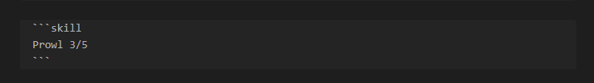
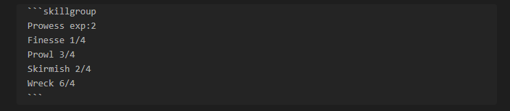
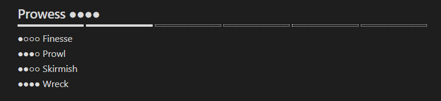
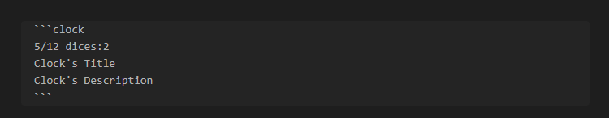
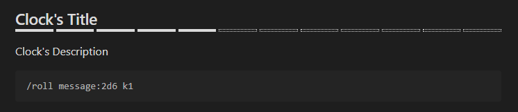

# BiTD to Obsidian
A plugin for managing skills and clocks in Obsidian, featuring progress bars, copy-to-clipboard roll commands for **Dice Maiden** in **Discord**, and customizable skill group displays.

## Installation
### Manual Installation
1. Go to the Releases page and download the latest version.
2. Unzip the files and place them in your Obsidian plugins folder: `Your_Vault_Folder/.obsidian/plugins/`
3. In Obsidian, go to `Settings > Community plugins` and enable the plugin.

## Usage
### `skill` Block
> Displays individual block for skill in a format that allows you to copy roll commands for each skill. 
> 
>**Just click on it for copy.**

#### Syntax:
```
skill
SkillName {current}/{max}
```

#### Example:



### `skillgroup` Block
> Allows you to group multiple skills with experience and auto calculating of group skill.
>
>**You also can click on any skill for copy.**

#### Syntax:
```
skillgroup 
GroupName exp:{experience count}
SkillOne {current}/{max}
SkillTwo {current}/{max}
...
```

#### Example:



### `clock` Block
> Allows create clocks with customizable divisions and copyable roll commands.

#### Syntax:
```
clock 
{current}/{max} dices: {dices count}
Clock's Title
Clock's Description
```

#### Example:

